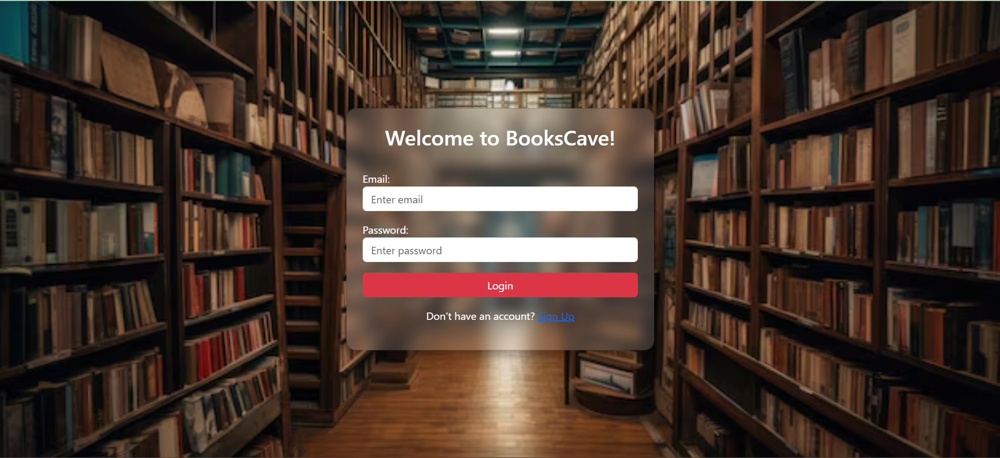
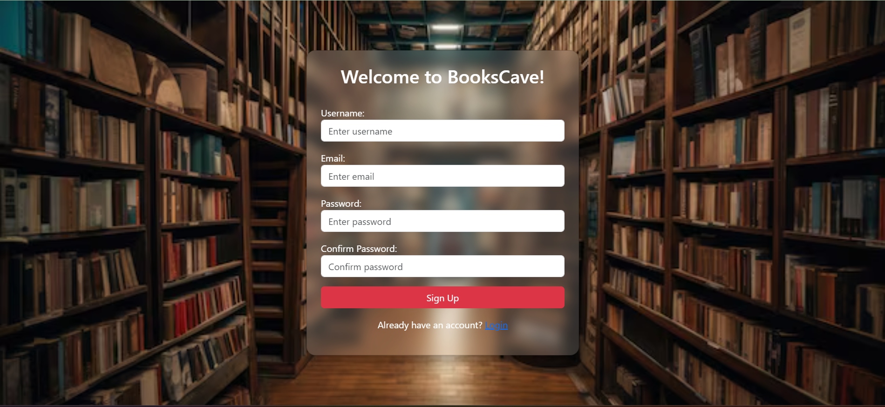
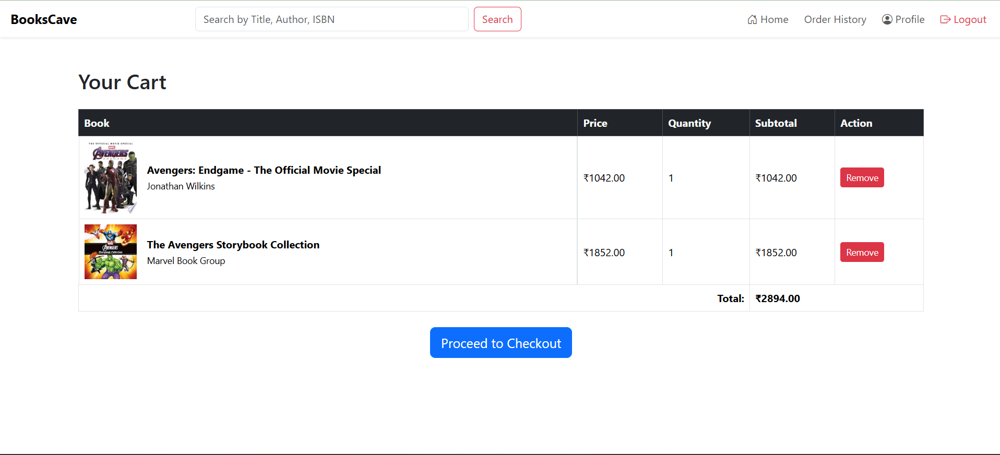
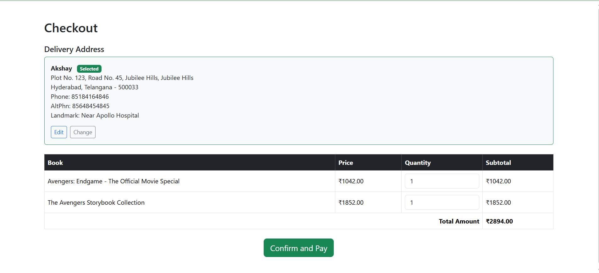
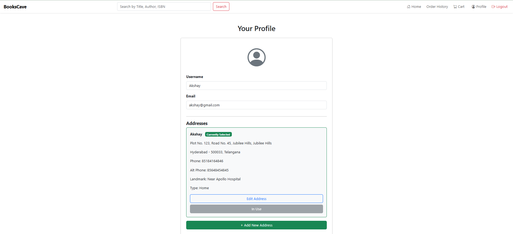
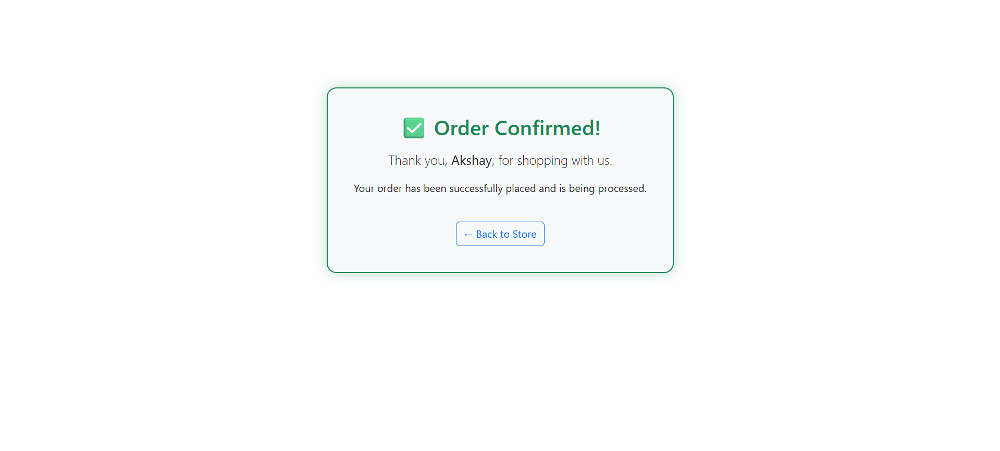

# 📚 BooksCave — Online Bookstore Web App

BooksCave is a full-stack e-commerce web application built as part of a capstone project. It allows users to browse, search, and purchase books using a smooth and user-friendly interface. This project demonstrates authentication, cart management, order processing, and secure data handling using modern web technologies.


## 💻 Technologies Used

- **Node.js & Express.js** — Backend server and routing
- **EJS** — Server-side templating
- **Firebase Firestore** — NoSQL database for user data, cart, orders, addresses
- **Firebase Admin SDK** — Secure backend integration with Firebase
- **Firebase Authentication** — Email/password-based login and signup
- **Bootstrap 5** — UI styling and responsive design
- **bcryptjs** — Password hashing for user security
- **Google Books API** — For fetching dynamic book data

---

## 🔐 Key Features

- ✅ **User Signup & Login**
  - Email/password-based authentication
  - Password hashing using bcrypt
  - Session-based login handling

- 🛒 **Cart Management**
  - Add to cart and remove from cart
  - Each user's cart is stored separately

- 📚 **Book Search**
  - Search books by title, author, or ISBN using Google Books API

- 💳 **Checkout Process**
  - Users can add, edit, and select shipping addresses
  - Confirm and place order with cart details

- 📦 **Order History**
  - View all previous orders with time/date and book list
  - Submit ratings for orders

- 🔒 **Secure Data Handling**
  - Each user’s data (cart, orders, address) stored in user-specific collections

---

## 📁 Folder Structure
BooksCave/
├── public/ # Static files (CSS, JS, images)
├── views/ # EJS frontend templates
│ ├── partials/ # Header, footer components
│ ├── signup.ejs, login.ejs, etc.
├── firebase.js # Firebase admin configuration
├── app.js # Main Express server
├── package.json


---

## 🧪 How to Run Locally

### 1. Clone the repository

```bash
git clone https://github.com/your-username/bookscave.git
cd BooksCave

npm install

```

## Firebase Setup
- Create a Firebase project from Firebase Console
- Enable Authentication (Email/Password)
- Create a Firestore database
- Generate a service account key and save it as serviceAccountKey.json in the root folder

- Create a file named .env in the root directory and add your Google Books API key:
-  GOOGLE_BOOKS_API=your_api_key_here

## Start the Server
- node app.js
Then open your browser and go to:
    http://localhost:3000

## 📸 Screenshots

### 🔹 Home Page


### 🔹 Login Page


### 🔹 Signup Page


### 🔹 Cart Page


### 🔹 Order History Page


### 🔹 Checkout Page


### 🔹 Profile Page with Address


### 🔹 Success Page



 ## 🙏 Thank You

